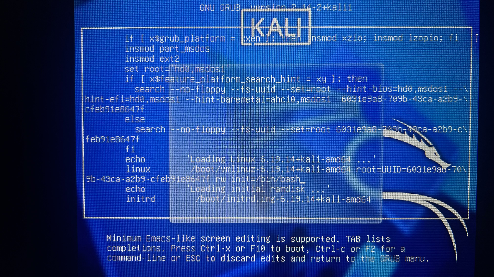
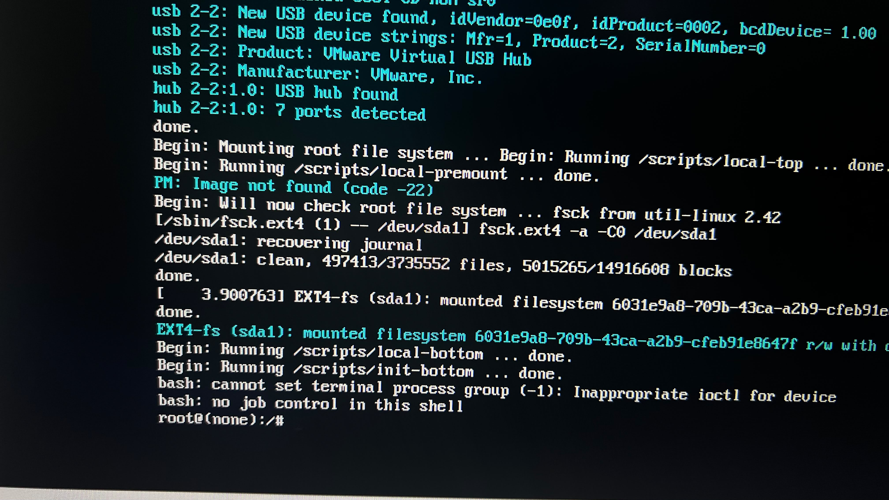
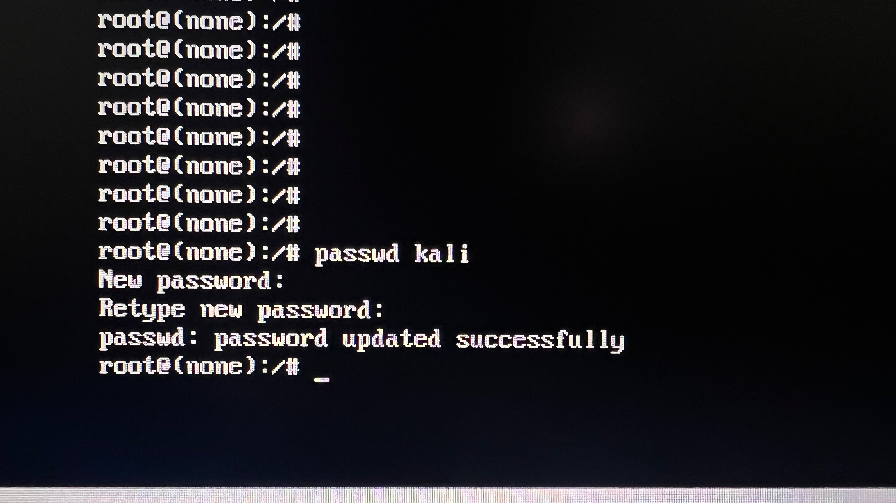

# 🔐 Kali Linux Password Recovery Using GRUB and Bash

## 📌 Overview

During the setup of my Blue Team cybersecurity home lab, I encountered a problem where I could no longer remember the password for my Kali Linux virtual machine.

Rather than rebuilding the virtual machine, I used the Linux boot process to access a Bash shell, reset the account password, and recover access to the existing Kali installation.

This exercise gave me practical experience with Linux boot configuration, Bash, account recovery, and the security implications of physical or console access to a system.

---

## 🎯 Objective

Recover access to an existing Kali Linux virtual machine without reinstalling the operating system or losing the existing lab configuration.

---

## 🖥️ Environment

- Kali Linux
- VMware virtual machine
- GRUB bootloader
- Bash shell
- Linux command line

---

## ⚠️ Problem

I was unable to log into the Kali Linux virtual machine because I could not remember the account password.

Since the virtual machine contained an existing lab environment, rebuilding Kali would have meant losing configuration and requiring additional setup.

The goal was therefore to recover access to the existing installation.

---

## 🔎 Recovery Process

### Step 1 — Access the GRUB Boot Menu

The Kali Linux virtual machine was restarted so that the GRUB boot menu could be accessed before the operating system fully loaded.

The Kali Linux boot entry was selected for editing.

---

### Step 2 — Modify the Linux Boot Parameters

The Linux kernel boot parameters were edited to change the normal startup process.

The boot configuration was modified so that the system would start directly into a Bash shell instead of continuing to the normal graphical login environment.

This provided access to the system without using the forgotten account password.

#### Screenshot — Modified GRUB Boot Parameters

The GRUB boot entry was modified to start Kali Linux with a writable root filesystem and launch `/bin/bash` directly.



---

### Step 3 — Start the Bash Shell

The modified boot configuration was started.

Kali Linux loaded directly into a root Bash shell, bypassing the normal user login process.

At this point, the normal graphical login process had been bypassed.

#### Screenshot — Root Bash Shell Access

The modified boot configuration successfully loaded Kali Linux into a root Bash shell, shown by the `root@(none):/#` prompt.



---

### Step 4 — Make the Root Filesystem Writable

Because the filesystem may initially be mounted as read-only during this recovery process, it was remounted with write permissions before attempting to modify the account password.

```bash
mount -o remount,rw /
```

This allowed changes to be written to the system.

---

### Step 5 — Reset the User Password

The Linux `passwd` utility was used to assign a new password to the Kali user account.

```bash
passwd <username>

```

The new password was entered and confirmed when prompted.

> The actual password is intentionally not included in this repository.


#### Screenshot — Successful Password Reset

The `passwd kali` command was used from the root Bash shell to assign a new password to the Kali user account. The system confirmed that the password was updated successfully.



---

### Step 6 — Restart Kali Linux

After the password was successfully changed, the system was restarted so Kali could boot normally.

---

## ✅ Verification

After Kali Linux restarted:

1. The normal Kali login screen appeared.
2. The user account was selected.
3. The newly created password was entered.
4. Authentication succeeded.
5. Access to the existing Kali Linux environment was restored.

**Result: Password recovery successful.**

#### Screenshot — Kali Linux Access Restored

After restarting the virtual machine, Kali Linux booted normally and access to the graphical desktop environment was successfully restored using the new password.


---

## 🔐 Security Lesson

This exercise demonstrated an important security principle:

> Physical or console access to a computer can significantly weaken operating-system authentication controls.

If an attacker can manipulate the boot process of an inadequately protected system, they may be able to bypass normal authentication mechanisms and modify local account credentials.

Potential defensive measures include:

- Full-disk encryption
- Strong physical security
- BIOS/UEFI protections
- Secure Boot where appropriate
- Restricting unauthorized access to virtual machine files and hypervisors
- Protecting recovery and boot configuration options

---

## 🧠 What I Learned

This exercise helped me understand that password recovery is not simply an account-management task. It involves several layers of the operating system.

I gained practical experience with:

- GRUB and the Linux boot process
- Bash command-line access
- Linux filesystem permissions
- The `passwd` utility
- Authentication recovery
- System troubleshooting
- The security risks associated with unrestricted console access

Most importantly, I saw how access below the normal login layer can affect the security assumptions made at the operating-system authentication layer.

---

## ⚖️ Authorization

This procedure was performed on my own Kali Linux virtual machine in a controlled cybersecurity home-lab environment.

The documentation is provided for educational, system-administration, recovery, and defensive-security purposes.

---

[⬅️ Back to Blue Team Cybersecurity Home Lab](../README.md)
