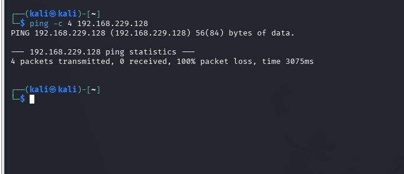
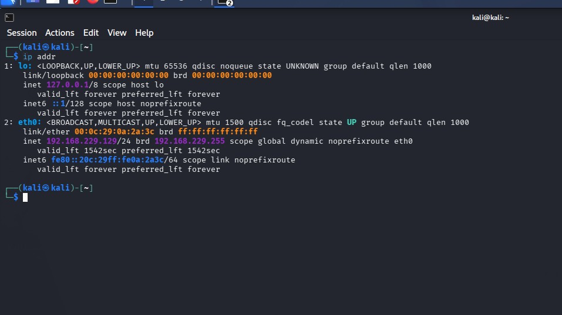
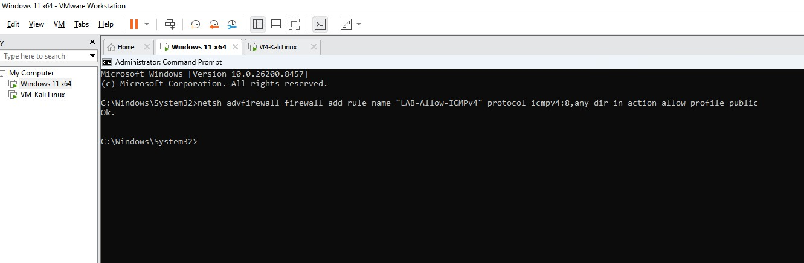

# 🌐 Kali Linux Network Connectivity Troubleshooting

## 📌 Overview

While configuring my Blue Team cybersecurity home lab, I encountered a network connectivity problem between my Kali Linux and Windows 11 virtual machines.

I attempted to ping the Windows 11 system from Kali Linux, but the ping failed.

Rather than assuming there was a general network failure, I investigated the network configuration and determined that Windows Firewall was preventing the Windows 11 machine from responding to inbound ICMPv4 Echo Requests.

I created a Windows Firewall rule to allow the required ICMPv4 traffic and then repeated the test from Kali Linux.

The second ping test was successful.

This exercise provided practical experience with Linux network troubleshooting, ICMP, Windows Firewall, administrative privileges, and verifying a network configuration change.

---

## 🎯 Objective

Troubleshoot a failed ping from a Kali Linux virtual machine to a Windows 11 virtual machine, identify the cause of the failure, correct the problem, and verify successful network communication.

---

## 🖥️ Environment

- Kali Linux
- Windows 11
- VMware virtual machines
- Linux command line
- Windows Command Prompt
- Windows Defender Firewall
- TCP/IP
- ICMP

---

## ⚠️ Initial Problem

After gaining access to my Kali Linux virtual machine, I began testing communication between systems in my home lab.

The Kali Linux machine needed to communicate with a Windows 11 virtual machine.

A ping test was performed from Kali Linux to the Windows 11 system.

```bash
ping <Windows-11-IP>
```

The ping failed.

**Initial Result: FAILED**

At this point, the failed ping did not necessarily mean that the Windows 11 system was offline or that the entire network connection was broken.

The failure could have occurred at several points in the communication process, so additional troubleshooting was required.

### Screenshot — Initial Ping Failure

The initial connectivity test from Kali Linux to the Windows 11 virtual machine failed. All four ICMP Echo Requests received no response, resulting in 100% packet loss.


---

## 🔎 Troubleshooting Process

### Step 1 — Examine the Kali Linux Network Configuration

I first examined the network interfaces configured on Kali Linux.

```bash
ip addr
```

The `ip addr` command displays information about the system's network interfaces, including:

- Available network interfaces
- Interface state
- IPv4 addresses
- IPv6 addresses
- MAC addresses
- Network configuration information

This allowed me to verify the Kali Linux system's network configuration before investigating the destination system.

### Screenshot — Kali Network Configuration

The `ip addr` command was used to verify the Kali Linux network interface and IPv4 address before connectivity testing.


---

### Step 2 — Test Connectivity to Windows 11

I attempted to communicate with the Windows 11 virtual machine using `ping`.

```bash
ping <Windows-11-IP>
```

The ping did not receive the expected responses from Windows 11.

**Result: Ping failed.**

Instead of assuming that the network itself was unavailable, I continued troubleshooting the destination Windows 11 system.

---

## 🛠️ Diagnosis and Correction

Further investigation showed that the problem was related to the firewall configuration on the Windows 11 virtual machine.

Windows Firewall was preventing the Windows 11 system from responding to the inbound ICMPv4 Echo Requests generated by the Kali Linux `ping` command.

### Step 3 — Open an Elevated Windows Command Prompt

Because changing Windows Firewall rules requires administrative privileges, I opened Command Prompt on the Windows 11 machine with administrator privileges.

This provided the permissions required to modify the firewall configuration.

---

### Step 4 — Create an ICMPv4 Firewall Rule

From the elevated Command Prompt, I created a new inbound Windows Firewall rule:

```cmd
netsh advfirewall firewall add rule name="LAB-Allow-ICMPv4" protocol=icmpv4:8,any dir=in action=allow profile=public
```

The rule was specifically created for the controlled home-lab environment.

### Understanding the Command

The command contains several important components:

- `netsh advfirewall firewall` — Accesses Windows advanced firewall configuration.
- `add rule` — Creates a new firewall rule.
- `name="LAB-Allow-ICMPv4"` — Assigns a recognizable name to the lab firewall rule.
- `protocol=icmpv4:8,any` — Matches ICMPv4 Type 8 traffic, which is an Echo Request used by `ping`.
- `dir=in` — Applies the rule to inbound network traffic.
- `action=allow` — Allows traffic that matches the rule.
- `profile=public` — Applies the rule to the Windows Public network profile.

The command required administrator privileges because it changed the security configuration of Windows Firewall.

### Screenshot — Windows Firewall ICMPv4 Rule

A Windows Firewall rule named `LAB-Allow-ICMPv4` was created to allow inbound ICMPv4 Echo Requests on the Public profile. Windows confirmed that the rule was added successfully.



---

## 🔄 Verification

After creating the firewall rule on Windows 11, I returned to Kali Linux and repeated the ping test.

```bash
ping <Windows-11-IP>
```

This time, Windows 11 responded to the ICMP Echo Requests.

**Result: SUCCESS**

The successful ping confirmed that communication between Kali Linux and Windows 11 was working and that the firewall rule corrected the original problem.

---

## 🔍 Root Cause Analysis

**Symptom:**  
Kali Linux could not successfully ping the Windows 11 virtual machine.

**Investigation:**  
The Kali network configuration was examined and connectivity to the Windows 11 machine was tested.

**Root Cause:**  
Windows Firewall was blocking inbound ICMPv4 Echo Requests on the Public network profile.

**Corrective Action:**  
An inbound Windows Firewall rule was created to allow ICMPv4 Type 8 Echo Request traffic.

**Verification:**  
The ping was repeated from Kali Linux and Windows 11 successfully responded.

---

## 🧠 What I Learned

This exercise demonstrated why a failed ping should be treated as a symptom rather than immediate proof of a broken network connection.

The destination system may be reachable while a host-based firewall prevents it from responding to ICMP traffic.

I gained practical experience with:

- Linux network troubleshooting
- The `ip addr` command
- The `ping` utility
- IPv4 networking
- ICMP Echo Requests
- Windows Defender Firewall
- Windows `netsh`
- Inbound firewall rules
- Administrative privileges
- Virtual machine networking
- Root-cause analysis
- Verifying configuration changes

Most importantly, I learned to troubleshoot connectivity systematically rather than immediately assuming that a failed ping means the destination system or network is unavailable.

---

## 🛡️ Blue Team Relevance

This exercise directly relates to defensive cybersecurity because host-based firewalls are an important part of endpoint security.

A Blue Team analyst needs to understand how firewall rules affect network traffic and how security controls can influence troubleshooting results.

For example, a failed ping could potentially result from:

- A disconnected host
- Incorrect IP configuration
- Routing problems
- Firewall filtering
- Network segmentation
- Host isolation
- Incident-response containment
- Security policy
- ICMP being intentionally disabled

Understanding the difference between a connectivity failure and firewall filtering helps prevent incorrect conclusions during troubleshooting and security investigations.

This exercise also demonstrated that firewall changes should be specific and controlled. Instead of disabling Windows Firewall entirely, I created a rule allowing only the ICMP traffic required for the lab.

---

## 🔐 Security Consideration

Disabling a firewall simply to solve a connectivity problem would unnecessarily reduce the security of the system.

A better approach is to identify the traffic that is required and create a specific firewall rule for that traffic.

In this case, the firewall remained enabled while an inbound rule was created specifically for ICMPv4 Echo Requests on the Public profile.

This maintained the firewall's other protections while allowing the network testing required by the lab.

---

## ⚖️ Authorization

All network testing and firewall configuration documented in this project was performed on virtual machines within my own controlled cybersecurity home-lab environment.

The systems were owned by me or under my control, and the testing was performed for educational, troubleshooting, and defensive-security purposes.

---

[⬅️ Back to Blue Team Cybersecurity Home Lab](../README.md)
