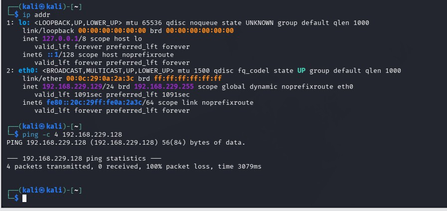
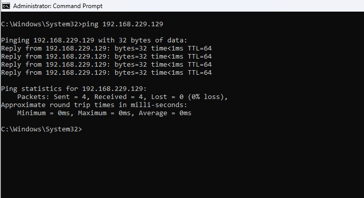
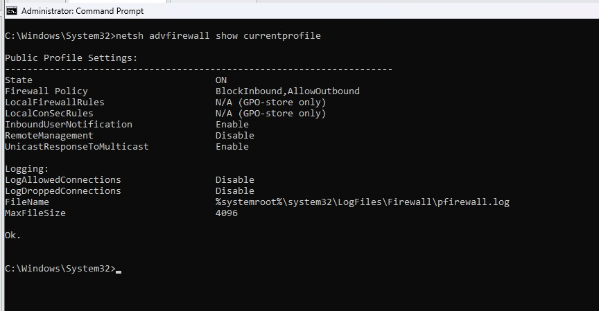
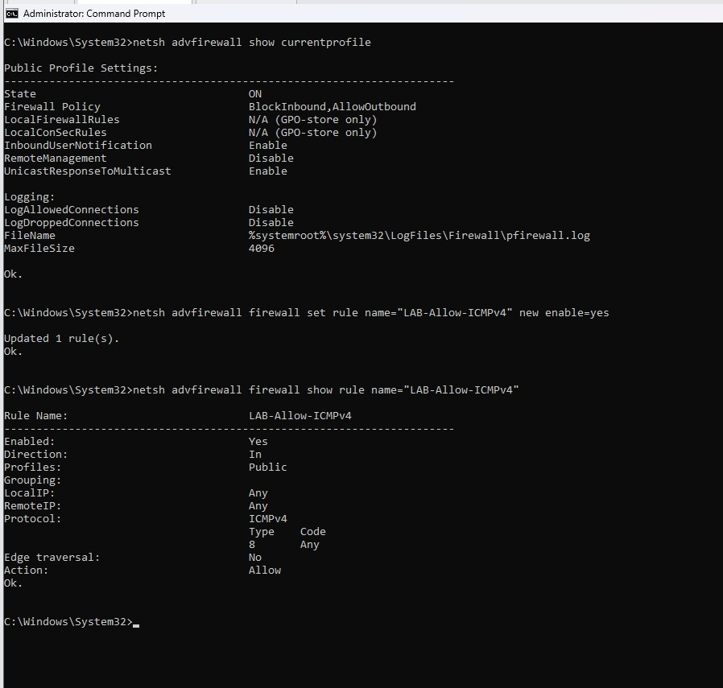
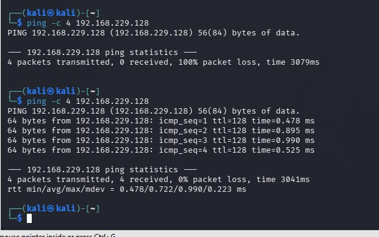

# 🛡️ Windows Firewall Analysis and ICMP Troubleshooting

## 📌 Project Overview

This lab demonstrates a structured troubleshooting process used to investigate failed ICMP communication between a Kali Linux virtual machine and a Windows 11 virtual machine.

Kali Linux was unable to ping the Windows 11 VM even though both systems were connected to the same VMware NAT network. I tested connectivity in both directions, examined the active Windows Firewall profile, identified the inbound firewall policy as the likely cause, enabled a targeted ICMPv4 firewall rule, and then retested the connection to verify the solution.

The Windows Firewall remained enabled throughout the investigation.

---

## 🖥️ Lab Environment

| System             | Role                      | IP Address         |
| ------------------ | ------------------------- | ------------------ |
| Windows 11 VM      | Target / Endpoint         | `192.168.229.128`  |
| Kali Linux VM      | Testing / Analysis System | `192.168.229.129`  |
| VMware Workstation | Virtualization Platform   | VMnet8 NAT         |
| Virtual Network    | Lab Network               | `192.168.229.0/24` |

---

## 🎯 Objective

The objective was to determine why Kali Linux could not successfully send ICMP Echo Requests to the Windows 11 VM while maintaining normal connectivity between the two systems.

The troubleshooting process followed these steps:

1. Verify the Kali Linux network configuration.
2. Test Kali-to-Windows connectivity.
3. Test Windows-to-Kali connectivity.
4. Examine the active Windows Firewall profile and policy.
5. Enable a specific inbound ICMPv4 rule.
6. Repeat the original connectivity test.
7. Compare the results before and after the firewall change.

---

## 🔎 Step 1 — Establish the Initial Problem

The Kali Linux VM was configured with the IPv4 address `192.168.229.129/24`.

I attempted to ping the Windows 11 VM at `192.168.229.128`.

```bash
ping -c 4 192.168.229.128
```

The test resulted in:

* 4 packets transmitted
* 0 packets received
* 100% packet loss

This established the initial connectivity problem.



---

## 🔎 Step 2 — Test Connectivity in the Opposite Direction

To determine whether the virtual network itself was functioning, I tested connectivity from Windows to Kali.

```cmd
ping 192.168.229.129
```

The Windows VM successfully received replies from Kali with 0% packet loss.



This demonstrated that the two virtual machines could communicate across the VMware network. The failure was therefore specific to traffic being sent toward the Windows system.

---

## 🔥 Step 3 — Investigate Windows Firewall

I examined the active Windows Firewall profile using:

```cmd
netsh advfirewall show currentprofile
```

The results showed:

```text
Profile:         Public
State:           ON
Firewall Policy: BlockInbound,AllowOutbound
```



The firewall was configured to block inbound traffic by default while allowing outbound traffic.

Based on the successful Windows-to-Kali test and failed Kali-to-Windows test, the inbound firewall configuration became the primary focus of the investigation.

---

## 🔧 Step 4 — Enable a Targeted ICMP Rule

Rather than disabling Windows Firewall, I enabled a specific lab rule permitting inbound ICMPv4 Echo Requests on the Public profile.

```cmd
netsh advfirewall firewall set rule name="LAB-Allow-ICMPv4" new enable=yes
```

I then verified the rule:

```cmd
netsh advfirewall firewall show rule name="LAB-Allow-ICMPv4"
```

The rule showed:

```text
Enabled:   Yes
Direction: In
Profiles:  Public
Protocol:  ICMPv4
Type:      8
Action:    Allow
```



ICMPv4 Type 8 represents an Echo Request, which is the request generated when another system attempts to ping the Windows endpoint.

---

## ✅ Step 5 — Validate the Change

After enabling the firewall rule, I repeated the original test from Kali:

```bash
ping -c 4 192.168.229.128
```

The second test resulted in:

* 4 packets transmitted
* 4 packets received
* 0% packet loss



The only intentional change between the failed and successful tests was enabling the targeted inbound ICMP firewall rule.

---

## 📊 Results

| Test                            | Result                     |
| ------------------------------- | -------------------------- |
| Kali → Windows before ICMP rule | ❌ 100% packet loss         |
| Windows → Kali                  | ✅ 0% packet loss           |
| Windows Firewall                | ✅ Enabled                  |
| Active Firewall Profile         | Public                     |
| Default Firewall Policy         | BlockInbound,AllowOutbound |
| Inbound ICMPv4 Type 8 Rule      | Enabled                    |
| Kali → Windows after ICMP rule  | ✅ 0% packet loss           |

---

## 🧠 Key Takeaways

This lab demonstrated that a failed ping does not automatically mean that a destination system is offline or that the network is broken.

Testing communication in both directions helped isolate the problem. Because Windows could successfully communicate with Kali while Kali could not initially ping Windows, the investigation shifted toward controls affecting inbound Windows traffic.

The issue was resolved without disabling the firewall. A specific ICMPv4 Echo Request rule was enabled instead, demonstrating the principle of making the smallest configuration change necessary to restore required connectivity.

### Skills Practiced

* Windows Defender Firewall administration
* Linux network troubleshooting
* ICMP connectivity testing
* Windows `netsh` commands
* Linux `ip` and `ping` commands
* Bidirectional connectivity testing
* Firewall rule analysis
* Troubleshooting methodology
* Verification and validation
* Technical documentation

---

## 🔐 Security Note

This lab was performed in an isolated personal virtualized environment using systems that I own and control. The configuration changes and network testing were performed solely for cybersecurity education and defensive security practice.

